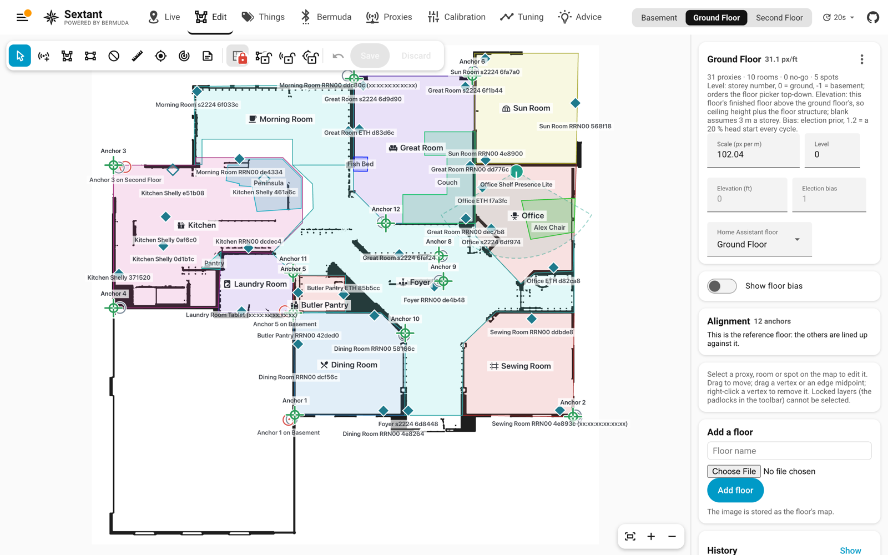

[Sextant](../README.md) › Edit

# Edit



A room can be linked to a **Home Assistant area** (and a floor to a Home
Assistant floor): pick it on the selected room, or press **Link rooms to
areas** to link every unlinked room on the floor to the area of the same
name. A room is a shape on a plan and an area a grouping of devices, so
they stay separate things, but linked, the room's label and the Live list
show the area's icon, and the sensors of a thing in that room carry
`area_id` (and `floor_id`), so an automation can act on the area itself:

```yaml
action: light.turn_on
target:
  area_id: "{{ state_attr('sensor.david_sextant_person_location', 'area_id') }}"
```

Changes live in the page until **Save**. Switching floor, leaving the Edit
page, or reloading asks first, so a draft is not lost by accident;
**Discard** throws it away on purpose.

The same map as an editor. Place proxies from a searchable list of the
scanners Bermuda knows (a proxy belongs to one floor), drag them, give them
a mount height. A dragged proxy snaps onto a wall within about 25 cm, a few
centimetres inside the room you are dragging it from, and stays on that
side until you pull it well past the wall: a proxy in an outlet or a switch
is part of the wall, and which side it lands on decides which room it
counts for. Hold Alt to place one freely. A proxy's panel also has **Use in
positioning**: off keeps it out of the solve, the floor election, anchoring
and spot evidence while it stays placed (drawn hollow), calibrated and
self-tested - for a proxy that hears fine but reads wrong where it sits
(metal under the counter, a range hood) and keeps dragging the fix its way. Draw rooms, spots and no-go areas as polygons: vertices
drag, edge midpoints add a vertex, right-click removes one. An edge within
7° of horizontal, vertical or 45° snaps exact as you draw or drag a
corner - the preview turns orange when it does - so right angles and cut
corners come out clean without aiming; a corner between two such edges
lands where they cross. Hold Alt to place a corner freely; a wall at any
other angle is never close enough to snap. **Square up** on a selected
room or spot does the same to a shape drawn before. A selected spot also
takes its real size: measure the furniture, type the width (across the
plan) and depth (up the plan) in inches or centimetres, pick the corner to
keep where it is, and **Set size** makes the spot that exact rectangle.
**Proxies on this spot** names the proxies sitting on or against the
furniture (a nightstand, an outlet at each end of a couch): when one hears a
thing close by and clearly closer than every proxy not on the spot, that
counts as the thing being on the spot, however wide the position estimate
is. Its weight fades as the reading grows (full within
1.2 m, none from 2 m) and as another proxy reads nearly as close, so being
the nearest proxy from across the room says nothing; the edges are on the
Tuning page under Spots. **Entry share** overrides the Tuning page's
`subzone_enter_prob` for this spot alone; blank uses it.
Pinch to zoom on a phone or tablet. Set the scale
by measuring a known distance. Give a floor a *level* (0 ground, -1
basement, 1 above) for ordering and an election *bias* (1.15 gives the
ground floor a standing head start; where one number for the whole floor
is too blunt, see [bias fields](positioning.md)). **Show floor bias**
under the floor's settings colours the plan by where its election prior
leans against a neighbouring floor's, at the same place in the house: grey
where the two are even, green where a thing leans to the other floor, red
where it leans to this one. The Basement and the Second Floor are compared
with the floor nearest in level; a floor between two picks either. It
shows the saved layout. Padlocks lock rooms, spots and
proxies against selection so you cannot drag a wall while placing a proxy;
rooms start locked. A spot belongs to one room: the room under its first
corner (or under its middle, if that corner is outside every room). Save
trims any part that pokes through that room's walls, and a spot dragged
wholly into another room moves to that room. A selected spot can be limited to the thing classes it
takes — pick phone, watch and keys on a bedside table, cat on a cat bed —
and nothing else will be placed there; pick none and it takes anything.
Person also takes a man, a woman or a child, Pet also takes the dog or the
cat, and Bag also takes a backpack, a purse or luggage — shown outlined in
the picker so the spot's reach is visible.
Undo holds fifty steps. **Adjust rooms** squares
near-rectangles, snaps neighbours to shared walls and removes overlaps
with a live preview. Nothing is written until Save.

## A busier plan than the map needs

A plan drawn for a builder carries a tile hatch over every floor, room
names, room dimensions and a title block. Sextant draws its own rooms,
proxies and things on top of it, and all that ink competes with them —
badly, on a phone. `tools/clean_floorplan.py` strips a plan down to its
walls and door swings, which is all the map needs behind the rooms you
draw:

```bash
python3 tools/clean_floorplan.py "Ground Floor.jpg" -o "Ground Floor.png"
```

It keeps the image's pixel dimensions, so the floor's scale and everything
already placed on it still line up; upload the result as that floor's plan.
What separates a wall from the rest is mostly weight, so `--thick` is the
knob that matters: raise it if hatch survives, lower it if walls break up.
Two other passes handle what weight cannot: `--diagonal` drops the
45-degree rules that fill an "open to below" area, which are drawn as
heavily as a wall, and `--dashes` drops dashed lines, which mark what is
not built on this storey. Keep the original — every plan is drawn
differently, and this is a one-way trip.

## mmWave sensors

An mmWave presence sensor that tracks people as coordinates - an Everything
Presence Pro or Lite, an Apollo R PRO-1, anything reporting
`target_1_x` / `target_1_y` - can be put on the plan with the **mmWave**
tool. Click where it is mounted, pick the device (Sextant finds every
device that reports target coordinates), and turn the marker the way the
sensor faces: 0° is straight up the plan, clockwise from there, with quick
buttons for the four walls and 15° nudges. The wedge drawn from it is what
it sees: the range set on the device, ±60° either side.

While it is selected, its targets show as pink dots, placed as the draft
has it, refreshed every two seconds. Walk straight away from the sensor:
your dot should follow the wedge's centre line. Off at an angle, turn the
marker; moving the wrong way sideways, turn on **Flip left/right** (makers
disagree on which side positive x is). An installation angle set on the
device already turns the coordinates it reports, so face the marker the way
that turned frame points.

**Mount height** is how high the sensor is. It measures a straight line from
there to your chest (about a metre up), so from 2 m up someone a metre out
reads 40 % too far and someone 3 m out 5 % too far; with the height set,
Sextant turns that into distance across the floor, and the wedge shows how
far across the floor the range reaches. **Counts people in** keeps its
targets to one room: by default the room the sensor is in (or on the wall
of), any room you pick, or "Everywhere it sees". These sensors see through
drywall, so without it someone on the other side of the wall is a target
too. Targets outside the room are hollow dots while you check it, and the
wedge is filled only inside the room. To stop it seeing past a doorway at
all, lower the max distance on the device itself.

Saved, a placed sensor does three things every cycle:

- **Places things.** A thing whose Bluetooth fix is within
  `mmwave_pair_m` (1.5 m) of a target is put on the target, to a few tens of
  centimetres. Its Live card says "placed by" the sensor. Only things that
  go with a body can claim a target - a phone, a watch, a person, a pet, or
  a thing with no class - because the radar sees people and animals, not
  objects: headphones on the desk or a Tile on the shelf never take the
  person sitting beside them.
- **Takes location pins.** When a sensor sees exactly one target, one thing
  has claimed it, and both have been still for a minute, that is a location
  pin nobody had to tap - at most one per thing per half hour, never within
  a metre of that thing's last, and the newest 30 per thing kept. They join
  the pins you place yourself, as fingerprint references and in the
  accuracy score, marked as coming from the sensor.
- **Counts people without a device.** A target no thing claims - a guest, or
  someone whose phone is in another room - shows on Live as a dashed
  marker with a question mark, and in `sensor.sextant_untracked_people`
  (the count, with the rooms as an attribute). A robot vacuum claims its
  target like any thing, so it is not counted, but it is not moved by it.

`mmwave_fusion` and `mmwave_auto_pins` on the Tuning page turn the first two
off without removing the sensor.

## Lining the floors up

Each floor is its own drawing, at its own resolution, cropped its own way,
so out of the box Sextant has no idea how they stack: it cannot tell
whether a spot on the Second Floor plan is above the foyer or above the
garage. **Anchors** fix that.

Pick points that run straight up through the house and that you can find on
every plan: outside corners, a stair post, a stair opening, a chimney
breast. Avoid interior room corners: interior walls move between storeys,
so the corner of a room upstairs is often not above the corner of the room
below, even when the plans make it look that way. With the **Anchor**
tool, click each one. An anchor lands exactly on a room corner when one is near
(hold Alt to place it freely), which is both easier than aiming and more
accurate. Then switch floor and click the same points in the same order: the
names carry over, so linking a floor is a row of clicks. An anchor is green once
its name exists on another floor, amber while it is on its own, and red if
it disagrees with the rest.

Under the Anchor tool, **Next anchor** says which name the next click takes: a
name another floor is waiting on (the first by default), or **New anchor** for
a point no other floor has yet - the choice holds while you place several.
**not here** beside a name says that point does not exist on this floor (a
post only in the basement), so it is no longer offered; **Not on this
floor** lists those, and a click puts one back. An anchor placed under the wrong
name can be renamed in its panel, or split off with **New anchor**. An anchor only
needs to be on the floors it links: each pair of neighbouring floors wants
three or more shared anchors, and a floor lines up with the one it shares anchors
with.

Two shared anchors line a floor up. Use four to eight, spread across the plan:
the extra ones turn into a check. The **Alignment** card says how closely
the anchors agree ("typically within 8 cm; worst is NE corner at 21 cm"), which
anchor to look at first when they do not, and what scale the anchors themselves
imply. With well-spread anchors that figure is usually better than the single
tape measurement behind the floor's scale, and one button adopts it. The fit
deliberately does not absorb a scale error on its own: floors that lined up
while every distance on one of them stayed 3 % wrong would be worse than
floors that visibly disagree.

An anchor on the wrong corner is the usual mistake, and an easy one: the room
upstairs runs a few metres longer than the room under it, or its wall is set
in from the wall below, and the "same" corner is not the same point. The fit
looks for the smallest set of anchors whose removal leaves the rest agreeing,
sets those aside and names them, rather than letting two bad anchors drag every
good one a metre off. On the plan, a grey ring marks where the *other*
floors put each anchor; an anchor that disagrees is joined to its ring by a red
line, so a wrong corner shows as a long red line rather than a number. Move
the anchor to its ring's corner, or to whatever point really is straight above
- or delete it, which is usually the better answer: an anchor does not have to
exist on every floor, it only links the floors that carry it.
Anchors sit on corners, where proxies and walls also are, so they have their
own padlock in the toolbar: lock them to reach a proxy underneath one.
With fewer than five shared anchors nothing can be set aside with any
confidence, which is one more reason to place more than two.

The anchors' scale is only offered when at least four anchors agree with each
other, and only when it differs from the floor's by 1 % or more; below that
the difference is smaller than the anchors' own placement error. A scale read
out of anchors that disagree is noise with two decimals. After adopting it,
re-run [calibration](calibration.md) on that floor.

Anchors cannot give the vertical leg. **Elevation** is how far this floor's
finished floor sits above the ground floor's: the ceiling height below it
plus the floor structure, usually about 30 cm (a foot). Left blank, a storey
is taken as 3 m.

Nothing uses the alignment to move a thing yet. What it does today is put
every contending floor's fix into one frame in the per-cycle telemetry
(`floor_cands[*].house`, metres), so it can be seen whether two floors that
both hear a thing agree on where it is. That is the evidence the next step -
letting a proxy on one floor testify about a position on another - will be
built on.

