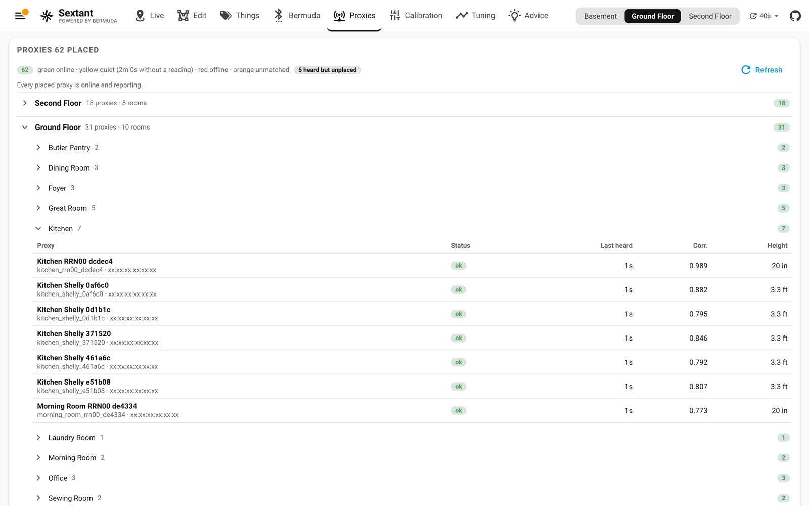

[Sextant](../README.md) › Proxies

# Proxies

Every placed proxy grouped by floor and room, with a count per group of
online, quiet (no reading for two minutes), offline and unmatched (placed
but no scanner by that name or address). Each row shows the last time it
heard anything, its calibration correction and its height. A second card
lists what each proxy hears right now, so a proxy that is up but not
scanning stands out.

The **self-test** takes each proxy in turn, hides it, locates it from the
other proxies' readings of its beacon, and measures how far that lands from
where you placed it. The result is broken down by floor and by room (median
and CEP95, the worst proxy in each), with rooms that have no proxy in them
listed as such: a whole-house figure hides exactly which rooms the proxies
place well. The whole-house CEP95 is published as
`sensor.sextant_position_accuracy` (metres) with per-floor and per-room
figures in its attributes; the full detail is at `/api/sextant/selftest`.
The self-test works from the calibration sample window, so a floor only has
figures once it has been sampled: a manual run samples one floor and
replaces the window, while **Auto calibration** keeps every floor sampled
in a rolling six-hour window. Turn it on if you want the whole house
covered.

**Wi-Fi signal by room** ranks the rooms by the median of their
[Wi-Fi signal](live.md#wi-fi-signal) squares, weakest first. Each row
shows the weakest square and the access point most squares are on. Below
the table are the sample count, each device's learned offset, and **Start
over**, which drops every sample. Use it after moving or replacing an access
point.
