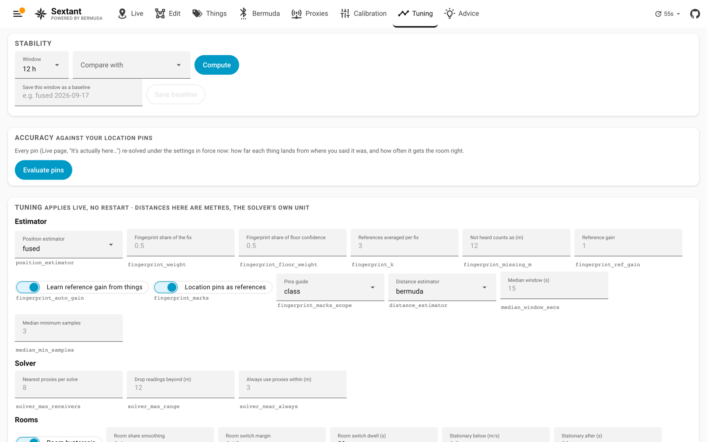

[Sextant](../README.md) › Tuning

# Tuning

The **stability KPI** reads the recorder for any window and reports, per
thing, room changes per hour, the share that were A → B → A flips, the
median dwell, and *far moves* per day: changes to a room on the same floor
whose outline is more than 2.5 m from the previous room's. A walked move
between such rooms passes through a room in between, so a far move the plan
never saw in between is a position that jumped. In the house this was
built on, each pet makes about ten a day (3 to 15), and they last about as
long as ordinary room changes: over three days, 43 % of far moves and 35 %
of all other same-floor moves were followed by another change within two
minutes. So the level is not alarming in itself; a rise after a change is.
Since 2026.10.06 the room election holds a far move to `far_move_margin`
and `far_move_secs` (0.3 and 45 s against 0.15 and 20 s for a move next
door), so a jump has to persist before it is published; this KPI is how to
see what that bought, and the two knobs are below it. Save a window as a named
baseline and compare later windows against it; the deltas turn green where
the window is better. Every
[tuning key](tuning.md#tuning-reference) is below it with a plain label, its meaning
on hover and the key underneath, grouped by estimator, solver, rooms,
spots, near-field anchor and floors, and applies on the next cycle without
a restart. Position history retention (off, one hour to seven
days) and **Clear history** live here too.

## Tuning reference

Set from the Tuning page or `sextant.set_tuning`. Stored with the layout;
distances in metres.

| Key | Default | Effect |
|---|---|---|
| `position_estimator` | `geometric` | `geometric`, `fingerprint` or `fused` |
| `fingerprint_weight` | 0.5 | fingerprint share of a fused fix |
| `fingerprint_floor_weight` | 0.5 | fingerprint share of a floor's confidence |
| `fingerprint_k` | 3 | references averaged per fix |
| `fingerprint_missing_m` | 12 | how far "not heard" counts as |
| `fingerprint_ref_gain` | 1.0 | probe beacons hotter (<1) or cooler (>1) than things |
| `fingerprint_auto_gain` | true | learn the rest of that gain from the things |
| `fingerprint_marks` | true | location pins double as fingerprint references |
| `distance_estimator` | `bermuda` | `bermuda` or `median` |
| `median_window_secs` | 15 | samples newer than this feed the median |
| `median_min_samples` | 3 | fewer falls back to Bermuda's distance |
| `solver_max_receivers` | 8 | nearest proxies per solve (0 = all) |
| `solver_max_range` | 12 | drop readings beyond this once three remain (0 = never) |
| `solver_near_always` | 3 | proxies within this always count |
| `zone_hysteresis` | true | off publishes the instantaneous room |
| `zone_prob_smoothing` | 0.6 | weight kept on the previous room shares per 15 s (a faster refresh compounds it, so the smoothing is the same in seconds) |
| `zone_switch_margin` | 0.15 | lead a challenger room needs |
| `zone_switch_secs` | 20 | held that long before switching |
| `far_move_margin` | 0.3 | the lead a room that is not next door needs (the larger of this and `zone_switch_margin`) |
| `far_move_secs` | 45 | held that long before a far move; 0 = no longer than any move |
| `stationary_speed` | 0.3 | m/s; slower is "still" |
| `stationary_secs` | 20 | still this long locks the room |
| `zone_unlock_margin` | 1.0 | metres outside the locked room |
| `zone_unlock_secs` | 30 | for this long to unlock |
| `zone_lock_warmup_secs` | 120 | no stationary lock until a thing has been tracked this long since a start or floor change |
| `subzone_switch_secs` | 20 | dwell before a spot change |
| `subzone_enter_prob` | 0.5 | smoothed share needed to enter a spot |
| `subzone_unlock_margin` | 1.0 | metres outside a spot before leaving it |
| `spot_proxy_near_m` | 1.2 | a spot's own proxy counts fully within this |
| `spot_proxy_far_m` | 2.0 | ...and not at all from this far |
| `spot_proxy_ratio` | 2.0 | every other proxy this many times farther for full weight (none within 1.25×) |
| `floor_switch_secs` | 60 | a challenger floor must lead this long |
| `floor_switch_margin` | 0.05 | the lead a challenger floor needs before that dwell starts; raise to 0.10 when a still thing drifts between two near-tied floors |
| `floor_tenure_bonus` | 0.05 | extra margin at full tenure |
| `floor_tenure_full_secs` | 600 | tenure counted up to this |
| `floor_proximity_weight` | 0.5 | how much proximity scales a floor's score (0 = fit only) |
| `wifi_floor_weight` | 0.25 | how much the access point a person's phone or watch is on sways their floor: a floor it never means scores this much less; 0 = off |
| `floor_proximity_blend` | `gated` | how that weight combines a floor's fit with its proximity: `gated` (fit × ((1 − w) + w × proximity): a poor fit caps the floor) or `geometric` (fit^(1 − w) × proximity^w: the nearest proxies can carry a floor whose fit is poor). Try `geometric` at weight 0.7 with `floor_switch_margin` 0.10 when a still thing next to an open foyer or landing keeps reading the floor below |
| `floor_proximity_k` | 3 | nearest proxies averaged for proximity |
| `anchor_max_m` | 0.8 | anchor when one proxy reads closer than this (0 = off) |
| `anchor_ratio` | 2 | every other proxy at least this many times farther |
| `anchor_secs` | 20 | for this long |
| `anchor_release_m` | 1.5 | release once the reading opens past this |
| `calibration_target` | `sextant` | where Apply writes: `sextant` or `bermuda` |
| `correction_close_fade` | on | fade a proxy's calibration stretch out at close range (see [calibration](calibration.md#close-range)) |
| `correction_fade_near_m` | 1.0 | a reading this close gets none of the stretch |
| `correction_fade_far_m` | 2.5 | from this far the stretch applies in full |
| `subzone_lock_release_m` | 2.5 | how far a still thing's fix must leave its spot before the room lock stops holding it there |
| `restore_state_secs` | 300 | how long a restart may take and still resume the elections rather than start cold. Five minutes covers a Home Assistant restart; a whole-host reboot (an operating system update) often takes longer, so raise it before one if you would rather keep the durations. Past the window Sextant logs a warning saying by how much, and still keeps each thing's last sighting, so "away since" stays right |
| `away_after_secs` | 900 | when the Live list stops waiting for a thing and calls it away |
| `fingerprint_marks_scope` | `class` | whose location pins place a thing: `own`, `class` (also things of its class) or `all` |
| `history_hours` | 6 | hours of position history kept (scrubber, timeline, Activity), 1 to 168 |
| `history_admin_only` | off | only administrators may read where things have been (scrubber, timeline, Activity) |
| `stale_after_secs` | 120 | unheard this long, a thing is drawn as a ghost on Live (display only) |
| `mmwave_fusion` | on | a thing whose Bluetooth fix is near an mmWave target is placed on the target |
| `mmwave_auto_pins` | on | one still target and one still thing make a location pin |
| `mmwave_pair_m` | 1.5 | how near a thing's Bluetooth fix must be to claim a target |
| `robot_poll_secs` | 30 | how often a robot vacuum that is out is asked where it is; each ask costs the Roborock integration a map parse (a few hundred ms on the event loop), a docked robot is never asked |
| `election_log_hours` | 0 | keep every floor election (each cycle's per-floor candidates, odds and winner, per thing) for this many hours in `config/sextant_election_log`, for `tools/replay_floors.py`; about 150 MB a day for twenty things, so 0 (off) unless you are chasing a wrong floor. Setting it back to 0 stops the writing but keeps the files; `sextant/election_log/clear` deletes them |

Two more live at the top level of the layout: `position_timeout` (seconds
before an unheard thing leaves the map, 300) and `thing_height` (the
default carry height in metres, 1.0; per-thing heights come from the
Things page).
